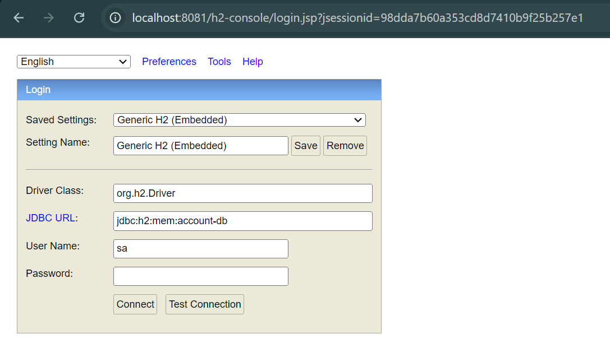

# Practical activity N°1 - developpe a simple microservice with spring

in this activity we try to build a simple microservice `account-service` using spring ecosystem.


## Dependencies

in this application, we need spring dependencies got it from [spring initializer](https://start.spring.io/)
and also some additional dependencies that resolved from [maven repository](https://mvnrepository.com/), 
those dependencies are grouped here:

```xml
 <dependencies>
    <dependency>
        <groupId>org.springframework.boot</groupId>
        <artifactId>spring-boot-starter-data-jpa</artifactId>
    </dependency>
    <dependency>
        <groupId>org.springframework.boot</groupId>
        <artifactId>spring-boot-starter-graphql</artifactId>
    </dependency>
    <dependency>
        <groupId>org.springframework.boot</groupId>
        <artifactId>spring-boot-starter-web</artifactId>
    </dependency>

    <dependency>
        <groupId>com.h2database</groupId>
        <artifactId>h2</artifactId>
        <scope>runtime</scope>
    </dependency>
    <dependency>
        <groupId>org.projectlombok</groupId>
        <artifactId>lombok</artifactId>
        <optional>true</optional>
    </dependency>
    <dependency>
        <groupId>org.springframework.boot</groupId>
        <artifactId>spring-boot-starter-test</artifactId>
        <scope>test</scope>
    </dependency>
    <dependency>
        <groupId>org.springframework</groupId>
        <artifactId>spring-webflux</artifactId>
        <scope>test</scope>
    </dependency>
    <dependency>
        <groupId>org.springframework.graphql</groupId>
        <artifactId>spring-graphql-test</artifactId>
        <scope>test</scope>
    </dependency>

    <!-- https://mvnrepository.com/artifact/org.springdoc/springdoc-openapi-ui -->
    <dependency>
        <groupId>org.springdoc</groupId>
        <artifactId>springdoc-openapi-starter-webmvc-ui</artifactId>
        <version>2.6.0</version>
    </dependency>

    <!-- https://mvnrepository.com/artifact/org.mapstruct/mapstruct -->
    <dependency>
        <groupId>org.mapstruct</groupId>
        <artifactId>mapstruct</artifactId>
        <version>1.6.2</version>
    </dependency>
    <!-- https://mvnrepository.com/artifact/org.mapstruct/mapstruct-processor -->
    <dependency>
        <groupId>org.mapstruct</groupId>
        <artifactId>mapstruct-processor</artifactId>
        <version>1.6.2</version>
    </dependency>

</dependencies>
```

## BankAccount Entity

```java
@Entity
@AllArgsConstructor @NoArgsConstructor @Builder
@Getter @Setter @ToString
public class BankAccount {
    @Id
    @UuidGenerator(style = UuidGenerator.Style.RANDOM)
    private String id;
    private LocalDateTime createdAt;
    private Double balance;
    @Enumerated(EnumType.STRING)
    private Currency currency;
    @Enumerated(EnumType.STRING)
    private AccountType type;
}

```

## BankAccountRepository

```java
public interface BankAccountRepository extends JpaRepository<BankAccount, String> {
}

```


## testing DAO layer

before testing our DAO layer, first we need to configure our `H2 database` and some additional configs:

```yaml
server:
  port: 8081

spring:
  application:
    name: practical-activity-1
  datasource:
    url: jdbc:h2:mem:account-db
  h2:
    console:
      enabled: true


```

in the spring boot application class we create a method of type `CommandLineRunner`, 
annotated with `@Bean` annotation

```java
  @Bean
    CommandLineRunner start(BankAccountRepository bankAccountRepository){
        return args -> {

            IntStream.iterate(0, i -> i <= 10 , i -> i + 1)
                    .mapToObj(i -> BankAccount.builder()
                            .balance(1000 + Math.random() * 9000)
                            .createdAt(LocalDateTime.now())
                            .type(Math.random() > 0.5 ? AccountType.CURRENT_ACCOUNT : AccountType.SAVING_ACCOUNT)
                            .currency(Math.random() > 0.5 ? Currency.MAD: Currency.EUR)
                            .build()
                    )
                    .forEach(bankAccountRepository::save);

        };
    }
```

opening the browser and request for `http://localhost:8081/h2-console`, the h2 console will be opened:



and we can see all bank account records are here:


## Web service RESTFULL

to create a web service based on REST full for `BankAccount` entity, 
we create a controller `BankAccountRestController` :

```java
@RestController
@RequestMapping("/bankAccounts")
@RequiredArgsConstructor
public class BankAccountRestController {
    //methods...
}
```

and we add the mapping methods, like get, post, put and delete:

### Post method

```java
@PostMapping
public ResponseEntity<?> createBankAccount(@RequestBody BankAccount bankAccount) {
    bankAccount.setCreatedAt(LocalDateTime.now());
    return ResponseEntity
            .status(HttpStatus.CREATED)
            .body(bankAccountRepository.save(bankAccount));
}

```

### Get method

```java
@GetMapping
public ResponseEntity<?> getAllBankAccounts() {
    return ResponseEntity.ok(bankAccountRepository.findAll());
}

@GetMapping("{id}")
public ResponseEntity<?> getBankAccountById(@PathVariable String id) {
    try {
        BankAccount bankAccount = bankAccountRepository
                .findById(id)
                .orElseThrow(() -> new Exception("bank account not found for id: " + id));
        return ResponseEntity.ok(bankAccount);
    }catch (Exception exception){
        return ResponseEntity.notFound().build();
    }
}

```

### Put method

```java
@PutMapping("{id}")
public ResponseEntity<?> updateBankAccount(@PathVariable String id, @RequestBody BankAccount newAccount) {
    try{
        BankAccount account = bankAccountRepository
                .findById(id)
                .orElseThrow(() -> new Exception("bank account not found for id: " + id));

        if (newAccount.getBalance() != null)
            account.setBalance(newAccount.getBalance());
        if (newAccount.getType() != null)
            account.setType(newAccount.getType());

        if(newAccount.getCurrency() != null)
            account.setCurrency(newAccount.getCurrency());

        return ResponseEntity.ok(bankAccountRepository.save(account));

    }catch (Exception exception){
        return ResponseEntity.notFound().build();
    }
}
```

### Delete method

```java
@DeleteMapping("{id}")
public ResponseEntity<?> deleteBankAccount(@PathVariable String id) {
    bankAccountRepository.deleteById(id);
    return  ResponseEntity.noContent().build();
}
```

## Testing the web service with Postman

### get all accounts


### get account by id


### create a new account


### update an account(ex: update balance)


### delete an account


## Generate api documentation using springdoc openApi


## Expose an endpoint using Rest Repositories and projections

to use spring data rest or rest repositories we simply add a maven dependency:

```xml
<dependency>
    <groupId>org.springframework.boot</groupId>
    <artifactId>spring-boot-starter-data-rest</artifactId>
</dependency>
```

and add `@RepositoryRestResource` to the `BankAccountRepository` interface, 
we notice that we change the detection strategy to `annotated`, 
to expose the repositories which are annotated with `@RepositoryRestResource`.

and we need to create some projections:

#### BankAccountFullProjection

```java
@Projection(name = "full", types = {BankAccount.class})
public interface BankAccountFullProjection {
    String getId();
    LocalDateTime getCreatedAt();
    Double getBalance();
    AccountType getType();
    Currency getCurrency();
}
```

#### BankAccountBasicProjection

```java
@Projection(name = "basic", types = {BankAccount.class})
public interface BankAccountBasicProjection {
    String getId();
    Double getBalance();
}
```

#### BankAccountTypeProjection

```java
@Projection(name = "type", types = {BankAccount.class})
public interface BankAccountTypeProjection {
    String getId();
    AccountType getType();
}

```

and let's test the exposed endpoint:


## DTOs and Mappers

### DTOs
we create two DTOs:
- `BankAccountRequestDTO` which is received from client to create or update an account.
- `BankAccountResponseDTO` which is exposed to the client side.


```java
public record BankAccountRequestDTO(
        Double balance,
        AccountType type,
        Currency currency
) {
    public void validate(){
        if (balance == null || balance <= 0)
            throw new NegativeBalanceException(balance);

        if(type == null || currency == null)
            throw new NullFieldException();

    }
}

```

notice that `validate` method is used to check if all record values are respect business logic.

```java
public record BankAccountResponseDTO(
        String id,
        LocalDateTime createdAt,
        Double balance,
        Currency currency,
        AccountType type
) {
}

```

### Mappers

to map `BankAccountRequestDTO` to a `BankAccount` object, 
and also map `BankAccount` to `BankAccountResponseDTO` we create a mapper, using `mapStruct` framework:

```java
@Mapper(componentModel = "spring")
public interface BankAccountMapper {
    BankAccount toBankAccount(BankAccountRequestDTO requestDTO);
    BankAccountResponseDTO toDTO(BankAccount bankAccount);
    void mapToExistingBankAccount(BankAccountRequestDTO source, @MappingTarget BankAccount target);
}
```
we notice that `componentModel = "spring"` used to delegate mapper initialization to spring.


## Business layer

to respect the norms, we should create a business layer of application, 
the interface that represent the business layer is:

```java

public interface BankAccountService {
    BankAccountResponseDTO addBankAccount(BankAccountRequestDTO bankAccountRequestDTO);
    BankAccountResponseDTO updateBankAccount(String id, BankAccountRequestDTO accountRequestDTO);
    void deleteBankAccount(String id);
    List<BankAccountResponseDTO> getAllBankAccounts();
    BankAccountResponseDTO getBankAccount(String id);
}

```

and for implementations:

```java
@Service
@Transactional
@RequiredArgsConstructor
public class BankAccountServiceImpl implements BankAccountService {

    private final BankAccountRepository bankAccountRepository;
    private final BankAccountMapper bankAccountMapper;

    @Override
    public BankAccountResponseDTO addBankAccount(BankAccountRequestDTO bankAccountRequestDTO) {
        bankAccountRequestDTO.validate();
        BankAccount account = bankAccountMapper.toBankAccount(bankAccountRequestDTO);
        account.setCreatedAt(LocalDateTime.now());
        bankAccountRepository.save(account);
        return bankAccountMapper.toDTO(account);
    }

    @Override
    public BankAccountResponseDTO updateBankAccount(String id,  BankAccountRequestDTO accountRequestDTO) {

        accountRequestDTO.validate();

        BankAccount account = bankAccountRepository
                .findById(id)
                .orElseThrow(() -> new ResourceNotFoundException("account: " + id));

        bankAccountMapper.mapToExistingBankAccount(accountRequestDTO, account);
        bankAccountRepository.save(account);
        return bankAccountMapper.toDTO(account);
    }

    @Override
    public void deleteBankAccount(String id) {
        bankAccountRepository.deleteById(id);
    }

    @Override
    public List<BankAccountResponseDTO> getAllBankAccounts() {
        return bankAccountRepository.findAll()
                .stream()
                .map(bankAccountMapper::toDTO)
                .toList();
    }

    @Override
    public BankAccountResponseDTO getBankAccount(String id) {
        return bankAccountRepository
                .findById(id)
                .map(bankAccountMapper::toDTO)
                .orElseThrow(() -> new ResourceNotFoundException("account: " + id));
    }
}

```

so `BankAccountRestController` will change:

```java
@RestController
@RequestMapping("/api/bankAccounts")
@RequiredArgsConstructor
public class BankAccountRestController {

    private final BankAccountRepository bankAccountRepository;
    private final BankAccountService bankAccountService;


    @GetMapping
    public ResponseEntity<?> getAllBankAccounts() {
        return ResponseEntity.ok(bankAccountService.getAllBankAccounts());
    }

    @PostMapping
    public ResponseEntity<?> createBankAccount(@RequestBody final BankAccountRequestDTO accountRequestDTO) {

        return ResponseEntity
                .status(HttpStatus.CREATED)
                .body(bankAccountService.addBankAccount(accountRequestDTO));
    }

    @GetMapping("{id}")
    public ResponseEntity<?> getBankAccountById(@PathVariable final String id) {
      return ResponseEntity.ok(bankAccountService.getBankAccount(id));
    }

    @PutMapping("{id}")
    public ResponseEntity<?> updateBankAccount
            (@PathVariable String id, @RequestBody BankAccountRequestDTO accountRequestDTO) {
       return ResponseEntity
               .ok(bankAccountService.updateBankAccount(id, accountRequestDTO));
    }

    @DeleteMapping("{id}")
    public ResponseEntity<?> deleteBankAccount(@PathVariable String id) {
        bankAccountService.deleteBankAccount(id);
        return ResponseEntity.noContent().build();
    }

}
```


we also create a class `BankAccountExceptionHandler` 
which be used for handle exceptions raised by `account-service` microservice:

```java

@ControllerAdvice
public class BankAccountExceptionHandler {

    @ExceptionHandler({NegativeBalanceException.class, NullFieldException.class})
    public ResponseEntity<?> handlerNegativeBalanceAndNullFieldException
            (final RuntimeException exception) {
        return ResponseEntity.badRequest().body(exception.getMessage());
    }

    @ExceptionHandler({ResourceNotFoundException.class})
    public ResponseEntity<?> handleResourceNotFoundException
            (final ResourceNotFoundException exception) {
        return ResponseEntity.status(HttpStatus.NOT_FOUND).body(exception.getMessage());
    }
}


```

### Testing new approach witch business layer and DTOs and Mappers


